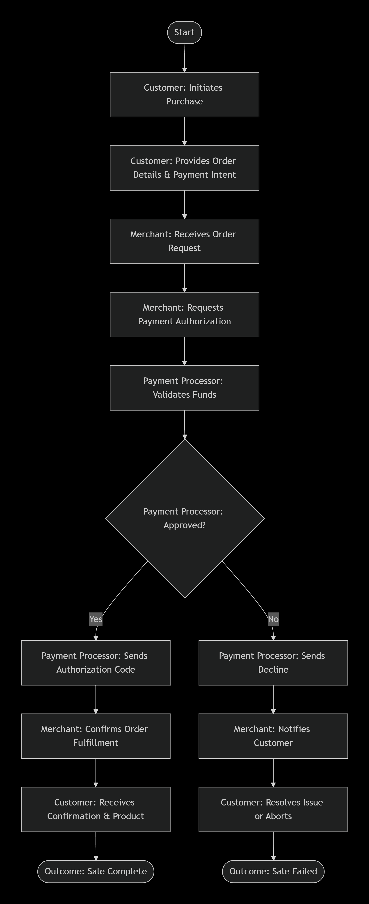
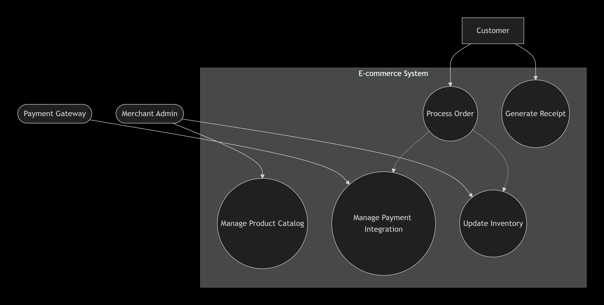
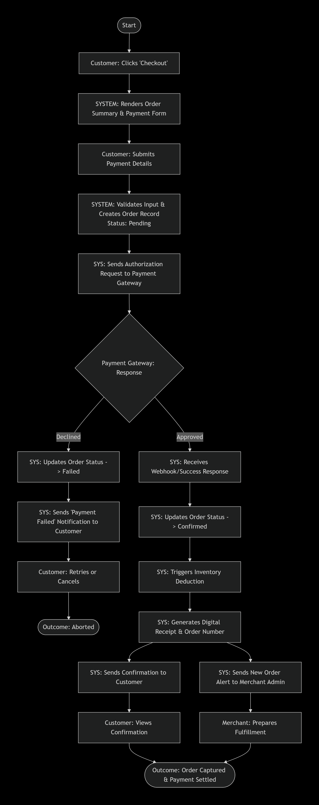

# Practical 2: UseCase

## Objective
To demonstrate a structured approach to business and systems analysis by progressing from:
1. **Actor-to-Actor Business Interaction** – Capturing the business workflow without system assumptions
2. **System Functional Requirements** – Defining what the system must support
3. **System-Supported Interaction** – Showing how actors interact through the system to achieve the business outcome

## Scenario
**Domain:** E-commerce Transaction  
**Business Outcome:** A customer successfully purchases a product, and the merchant receives payment confirmation  
**Actors:** Customer, Merchant, Payment Processor (Bank/Gateway)  
**System:** E-commerce Platform

## Diagrams

### 1. IoD – Actor to Actor (Business Perspective)
This diagram illustrates the business workflow focusing on interactions between human and organizational roles. The system is treated as a black box, emphasizing the handshake between **Customer**, **Merchant**, and **Payment Processor** to achieve the business outcome.

I started by mapping out how the business operates without assuming any existing software. This helped me identify the key touchpoints between actors and understand where value is exchanged.

### 2. UCD – System Functional Requirements
This Use Case Diagram defines the boundaries of the system and the functional capabilities required to digitize the business interactions identified in Step 1. It identifies key system features such as order processing, payment integration, inventory management, and notification services.

From the business workflow, I extracted what the e-commerce platform actually needs to do. I identified four primary use cases and mapped which actors interact with each one.

### 3. IoD – System Supported
This refined Interaction Overview Diagram merges the business workflow from Step 1 with the functional components from Step 2. The system now appears as an active participant (swimlane) facilitating the interactions between actors to achieve the business outcome.

This was the final step where I combined everything. The system is no longer a black box, it actively processes orders, communicates with the payment gateway, updates inventory, and sends notifications to both the customer and merchant.

## Traceability Matrix

| Step | Diagram | Key Focus | What I Learned |
| :--- | :--- | :--- | :--- |
| 1 | IoD – Actor to Actor | Business workflow / value exchange | Understanding the business process first prevents building features that don't align with real-world interactions |
| 2 | UCD | System scope & features | Defining system boundaries early helps manage scope and clarifies what is automated vs. manual |
| 3 | IoD – System Supported | System-mediated interaction | Seeing the system as an active participant made the technical requirements much clearer |

## Reflection

Completing this practical gave me a clearer understanding of how business analysis flows into system design. 

**What worked well:**
- Starting with the actor-to-actor perspective forced me to think about the business problem before jumping into system features
- The UCD acted as a natural bridge, it was easy to derive once the business interactions were mapped
- Creating the final system-supported IoD felt intuitive because I had both the business flow and functional requirements ready

**Challenges faced:**
- Deciding what level of detail to include in the first IoD. I initially included too much system detail before realizing it belongs in Step 3
- Ensuring the UCD only captured system functions and not business processes, this took some revision

**Key takeaway:**
This three-step approach ensures the software is built to enable real-world interactions, not just technical features. It also makes documentation traceable, anyone can follow from business need to system implementation.

## Tools Used
- Diagramming Tool: plantUML
- Ai tool link:https://chatgpt.com/c/69cab364-3db8-83e8-8fc9-506f02106c50
- Documentation: Markdown

