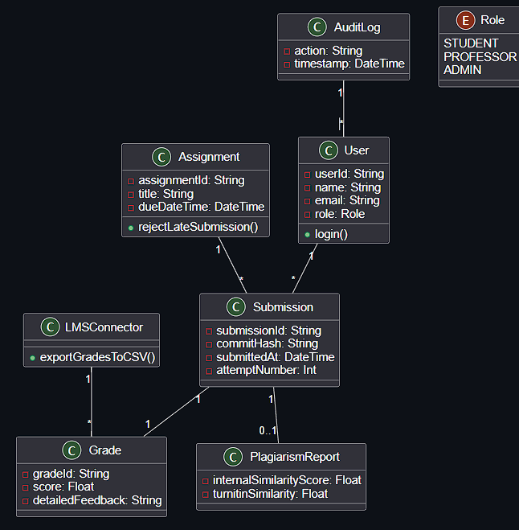
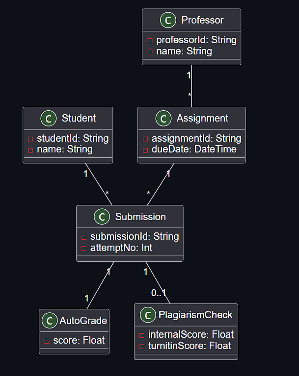

# Practical Report: UML Class Diagram & Object Model for Automated Grading System

## Objective
To design and document the static structure of an **Automated Grading System** for a university SWE course using UML class diagrams and class models, capturing entities, attributes, methods, and relationships.

---

## Scenario Overview

**Domain:** Academic Assessment (Software Engineering Course)  
**System:** Automated Grading Platform  

**Key Requirements:**
- Students upload source code via GitHub
- Automated grading based on professor-defined criteria
- Plagiarism detection (internal + TurnItIn)
- Integration with legacy mainframe LMS
- Due date enforcement with multiple submission attempts
- Audit trail for state regulatory compliance
- Low IT budget

---

## Diagram 1: UML Class Diagram (Full System)

This diagram shows the complete static structure of the automated grading system, including all major classes, their attributes, methods, and relationships.

**Key classes included:**
- `User` (with Student, Professor, Admin roles)
- `Assignment` and `Submission`
- `Grade` and `GradingCriteria`
- `PlagiarismReport`
- `AuditLog`
- `LMSConnector`



---

## Diagram 2: UML Class Model (Simplified / Object Model)

This is a simplified class model focusing only on the **core domain entities** and their essential relationships. It omits detailed methods and supporting classes to provide a clearer high-level view of the system structure.

**Core classes shown:**
- `Student`
- `Professor`
- `Assignment`
- `Submission`
- `AutoGrade`
- `PlagiarismCheck`



---

## Traceability Matrix

| Diagram | Focus | Key Relationships Captured |
| :--- | :--- | :--- |
| UML Class Diagram (Full) | Complete system structure | Student → Submission → Grade → PlagiarismReport; Assignment → GradingCriteria; AuditLog → all entities |
| UML Class Model (Simplified) | Core domain only | Student submits Assignment; Submission generates AutoGrade; Submission triggers PlagiarismCheck |

---

## Reflection (3 marks)

**What worked well:**
- Creating the full class diagram first helped me identify all necessary entities before simplifying.
- The simplified class model is much easier to explain to non-technical stakeholders while still capturing the essential structure.
- Defining relationships clearly (1-to-many, composition, dependency) prevented ambiguity about how data flows through the system.

**Challenges faced:**
- Deciding which classes to keep in the simplified model — I initially removed `AuditLog`, but then realized compliance requires it even in high-level views.
- Representing the LMS integration was difficult because the mainframe doesn't support normal APIs; I used an `LMSConnector` class to encapsulate that complexity.

**Key takeaway:**
A full class diagram ensures nothing is missed during implementation, while a simplified class model is better for documentation and client communication. Both are valuable at different stages of design.

---

## Clarity & Coherence (2 marks)

The diagrams are organized from **full detail** to **simplified view**, making the document easy to follow. Each diagram has a clear purpose, and the traceability matrix connects each diagram back to its role in the design process. Naming conventions are consistent across both diagrams, and relationships use standard UML notation (multiplicity, arrows, inheritance where applicable).


## Appendix: PlantUML Source Code

### UML Class Diagram
```plantuml
@startuml
!theme plain
title Automated Grading System - UML Class Diagram

class User {
  - userId: String
  - name: String
  - email: String
  - role: Role
  + login()
}

enum Role {
  STUDENT
  PROFESSOR
  ADMIN
}

class Assignment {
  - assignmentId: String
  - title: String
  - dueDateTime: DateTime
  + rejectLateSubmission()
}

class Submission {
  - submissionId: String
  - commitHash: String
  - submittedAt: DateTime
  - attemptNumber: Int
}

class Grade {
  - gradeId: String
  - score: Float
  - detailedFeedback: String
}

class PlagiarismReport {
  - internalSimilarityScore: Float
  - turnitinSimilarity: Float
}

class AuditLog {
  - action: String
  - timestamp: DateTime
}

class LMSConnector {
  + exportGradesToCSV()
}

User "1" -- "*" Submission
Assignment "1" -- "*" Submission
Submission "1" -- "1" Grade
Submission "1" -- "0..1" PlagiarismReport
AuditLog "1" -- "*" User
LMSConnector "1" -- "*" Grade
@enduml

### UML Object Model

@startuml
!theme plain
title Automated Grading System - Simplified Class Model

class Student {
  - studentId: String
  - name: String
}

class Professor {
  - professorId: String
  - name: String
}

class Assignment {
  - assignmentId: String
  - dueDate: DateTime
}

class Submission {
  - submissionId: String
  - attemptNo: Int
}

class AutoGrade {
  - score: Float
}

class PlagiarismCheck {
  - internalScore: Float
  - turnitinScore: Float
}

Student "1" -- "*" Submission
Professor "1" -- "*" Assignment
Assignment "1" -- "*" Submission
Submission "1" -- "1" AutoGrade
Submission "1" -- "0..1" PlagiarismCheck
@enduml

---

### Tools Used

- **Diagramming Tool:** PlantUML
- **Documentation:** Markdown
- **AI Assistance:** https://chatgpt.com/c/69d3f848-37c4-83e8-b1c9-43a0356c5dd4

---